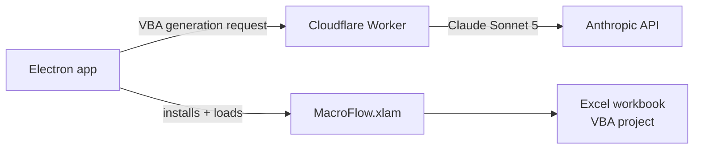

# MacroFlow
 
**Tell Excel what you want in plain English. MacroFlow writes the macro, runs it, and keeps it organized for next time.**
 
MacroFlow is a free Windows app that works alongside Excel. It uses AI (Claude Sonnet 5) to turn a simple request, such as *"format every sheet like this one"* or *"pull these columns into a summary tab"*, into working VBA automation. You don't need to know how to code. <!-- confirm "free" and swap in examples that match your demo -->
 
https://github.com/user-attachments/assets/bdd0bf86-2891-4888-b138-cc9bad93df85
 
<p align="center"><em>One-minute demo: MacroFlow automating a real income statement in Excel.</em></p>
<p align="center">
  <a href="https://pub-a7aa338dce944ce383fc182f58a87366.r2.dev/installer/MacroFlow-Setup.exe"><strong>⬇️ Download MacroFlow for Windows</strong></a>
  &nbsp;·&nbsp;
  <a href="https://macroflow.ai">macroflow.ai</a>
</p>
---
 
## Why I built this
 
<!-- 2–3 sentences in your own voice. For example: -->
I spent an internship writing VBA to automate hours of repetitive spreadsheet work, and I watched how much time it saved the people who used it. Most Excel users never get that benefit, because writing macros is a skill almost nobody has time to learn. MacroFlow is my attempt to give everyone that superpower.
 
## What it does
 
- **Create:** describe a task in plain English, and MacroFlow generates the VBA.
- **Run:** execute macros on your open workbook straight from the app.
- **Shortcuts:** save the automations you use most and rerun them with one click. <!-- confirm -->
- **Files:** keep your macros and workbooks organized in one place. <!-- confirm -->
- **No account needed:** download it, install it, and start using it.
## Install (about 2 minutes)
 
**You'll need:** Windows 10 or 11, and desktop Microsoft Excel (Microsoft 365 or 2019+). Excel for Mac and Excel on the web aren't supported.
 
1. **Download and run** [`MacroFlow-Setup.exe`](https://pub-a7aa338dce944ce383fc182f58a87366.r2.dev/installer/MacroFlow-Setup.exe).
   If Windows shows *"Windows protected your PC,"* click **More info → Run anyway**. <!-- delete this line once installers are code-signed -->
2. **Let MacroFlow write macros in Excel.** Excel blocks this by default, so this step is required:
   **File → Options → Trust Center → Trust Center Settings → Macro Settings →** check **Trust access to the VBA project object model**.
3. **Open Excel** (or restart it) and click **Home → MacroFlow**.
Keep Excel open while you use MacroFlow, since that's how it connects to your workbooks.
 
> 💡 **Save your files as `.xlsm`** (Excel Macro-Enabled Workbook). If you save as `.xlsx`, Excel deletes your macros when the file closes.
 
## Good to know
 
- **Your data:** when you use Create, your request <!-- and what workbook context? be exact --> is sent to Anthropic's Claude to generate the macro. Avoid using MacroFlow on confidential work files unless your company allows it.
- **No keys on your computer:** the AI key stays on MacroFlow's server and never ships in the app.
- **Review before you run:** AI-written macros can make mistakes. Try them on a copy of your file first, because macro changes can't be undone with Ctrl+Z.
- **VBA trust setting:** that option lets any program edit macros, not just MacroFlow, so you can turn it back off when you're done.
- **Updates** install automatically.
- **Uninstall** anytime from **Settings → Apps → Installed apps → MacroFlow**. This also removes the Excel add-in.
## Troubleshooting
 
| Problem | Fix |
|---|---|
| MacroFlow isn't on the Home tab | Close every Excel window (check Task Manager for hidden ones) and reopen Excel. |
| "Programmatic access not trusted" | Turn on the VBA trust setting from install step 2, then restart Excel. |
| My macros disappeared | Save the file as `.xlsm`, not `.xlsx`. |
| Something else | [Open an issue](../../issues) with your Windows and Excel versions, or reach out below. |
 
## Feedback and follow along
 
I'm building MacroFlow in public while starting my MBA at Yale SOM, and I'd love to hear what you automate with it, what breaks, and what you wish it did.
 
<!-- Add your links: Instagram · YouTube · LinkedIn · email -->
 
⭐ If MacroFlow saves you time, starring the repo helps other people find it.
 
---
 
<details>
<summary><strong>🛠️ For developers: architecture, dev setup, and publishing</strong></summary>
<br>
### How it works
 

 
The desktop app never contains an Anthropic key. Requests go through a Cloudflare Worker that holds it. The installer copies `MacroFlow.xlam` into Excel's XLSTART folder and tries to load it into any running Excel instance.
 
### Development mode
 
```bash
cd App
npm install
npm run dev
```
 
This starts Vite on `http://localhost:5173` and launches the Electron app.
 
### Deploy the AI Worker
 
```bash
cd worker
npx wrangler login
npx wrangler secret put ANTHROPIC_API_KEY
npx wrangler deploy
```
 
Point the app at your Worker with `MACROFLOW_AI_URL`. See [worker/README.md](worker/README.md).
 
### Publish a new installer
 
**Via GitHub Actions (recommended)**
 
1. Add these repository secrets: `AWS_ACCESS_KEY_ID`, `AWS_SECRET_ACCESS_KEY`, `S3_ENDPOINT`, `S3_BUCKET`.
2. Push a `v*` tag, or run **Build & Sign Windows** via `workflow_dispatch`.
3. CI builds on `windows-2022` and uploads the `windows-installer` artifact. When the secrets are set, it also publishes to R2 as `installer/MacroFlow-Setup.exe`.
**Locally** (Windows, with R2 keys and optional signing credentials)
 
```bash
cd App
npm install
npm run make
npm run upload:update
```
 
`App/scripts/publish-update.js` uploads two things:
- `installer/MacroFlow-Setup.exe`, the stable public download URL
- `updates/RELEASES` plus the `.nupkg`, which form the Squirrel auto-update feed
Both routes need the same environment variables: `AWS_ACCESS_KEY_ID`, `AWS_SECRET_ACCESS_KEY`, `S3_ENDPOINT`, `S3_BUCKET`.
 
### Key files
 
| Path | Purpose |
|---|---|
| `App/electron/main.js` | Electron window and app lifecycle |
| `App/electron/excel-addin-installer.js` | Installs and uninstalls the Excel add-in |
| `App/electron/llm-client.js` | Calls the Cloudflare Worker for VBA generation |
| `App/Resources/MacroFlow.xlam` | Excel add-in copied into XLSTART |
| `App/package.json` | App metadata, scripts, and dependencies |
| `docs/excel-bridge-api.md` | The `window.excel` API exposed to the UI |
| `worker/` | Anthropic proxy (Claude Sonnet 5) |
 
</details>
## License
 
<!-- Choose deliberately. With no license, people can view the code but not reuse it. -->
Copyright © 2026 Ronan. All rights reserved.
